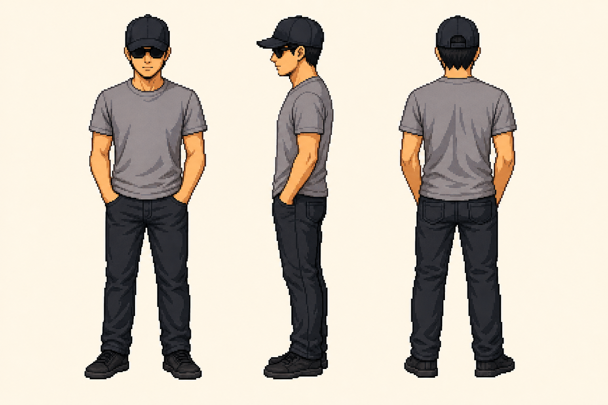
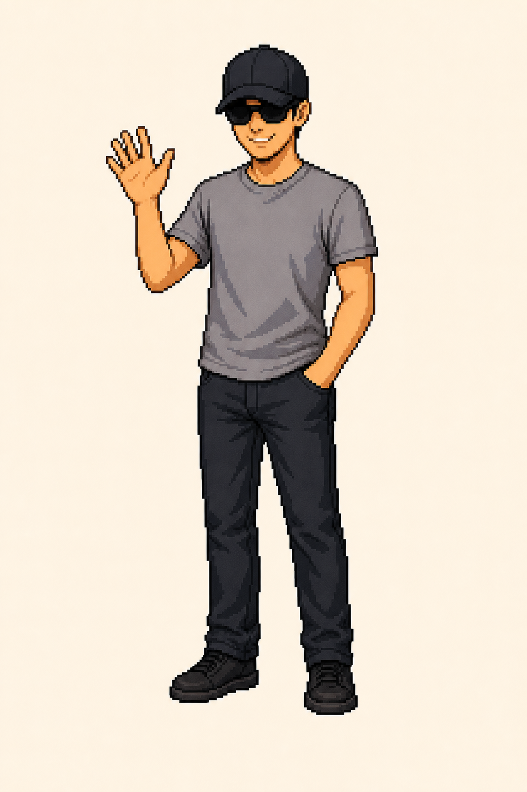
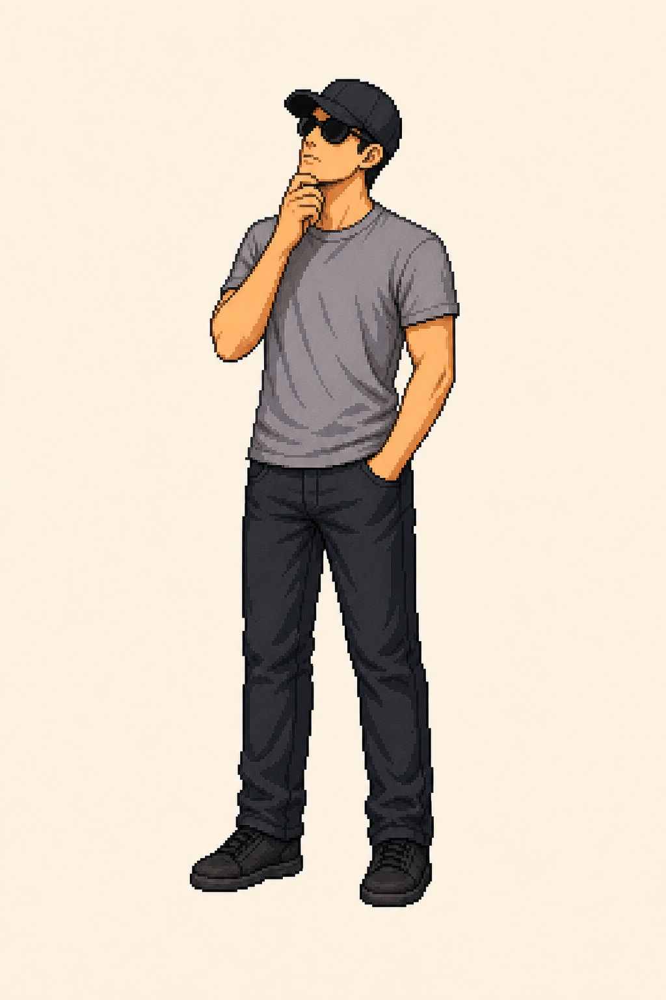
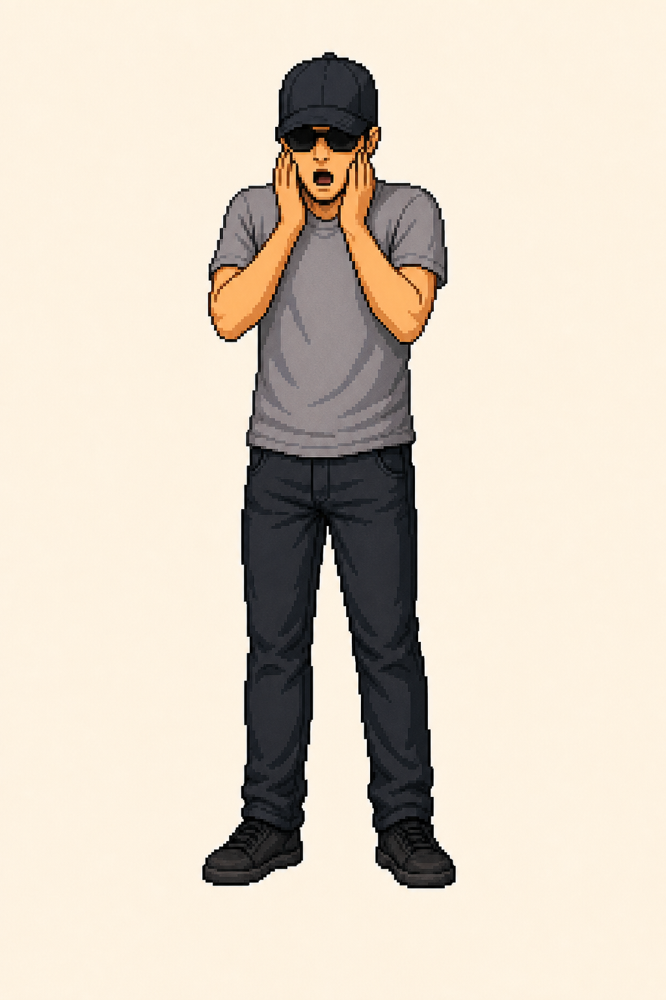
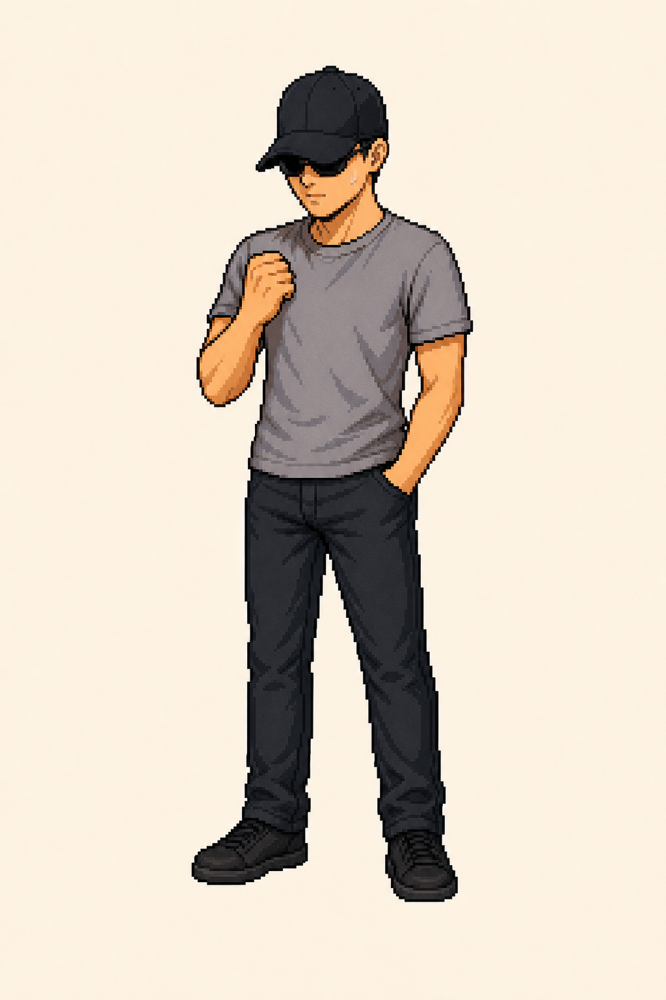
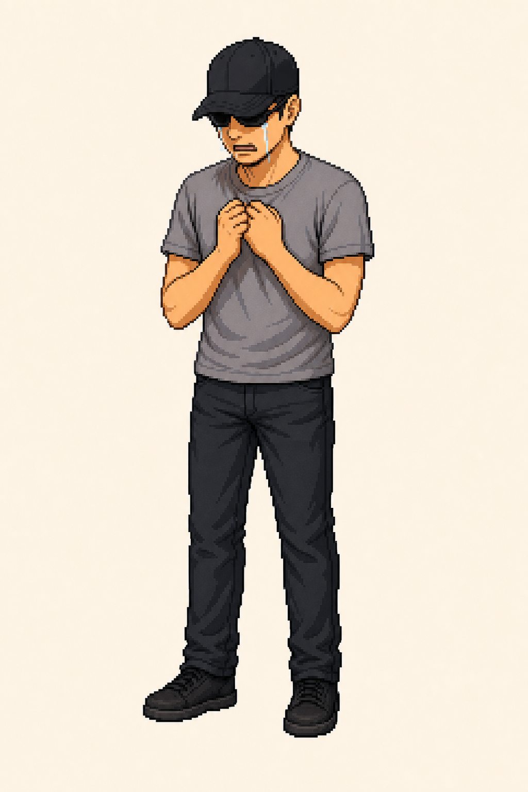
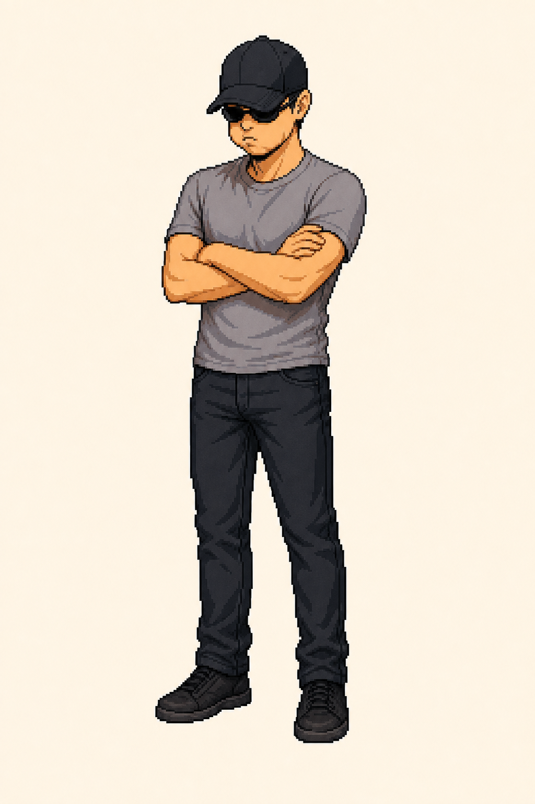
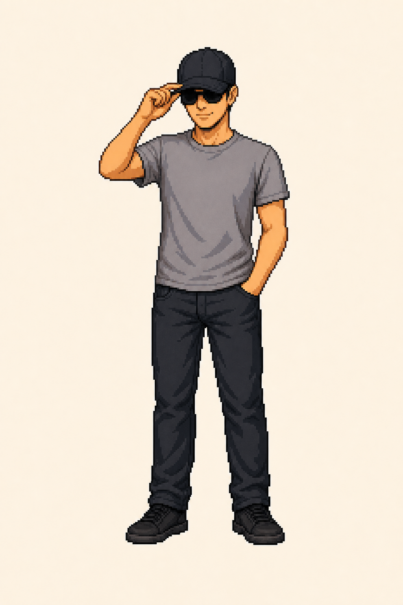

# Character IP Studio


从一张参考图出发，制作一套可复用的角色 IP 素材。它适合像素艺术、轻松卡通、现代插画和其他由用户确认的视觉方向，而不局限于任何单一角色比例或风格。

## 能做什么

- 用统一的选择题确认创意方向，再开始绘制。
- 建立前、侧、背三视图，作为整套角色素材的视觉基准。
- 输出 8 张独立姿势图，适用于聊天、社交媒体和品牌视觉。
- 生成角色说明与逐项质量审核；用户确认后才标记为最终交付。
- 支持透明底色的贴纸制作流程。

## 工作流程

```text
创意选择 → 角色三视图 → 8 个姿势 → 质量审核 → 用户确认 → 交付
```

## 创意选择题

每次创建新形象时，技能都会先提出以下 7 道题。回复选项编号即可；选择“其他”时补充说明。

1. 画风
   - A. 轻松可爱的卡通风
   - B. 像素艺术
   - C. 现代插画
   - D. 其他（请说明）
2. 身材设定
   - A. 迷你卡通比例
   - B. 写实偏简化的成人比例
   - C. 以参考图身材为准
   - D. 其他（请说明）
3. 画面细节
   - A. 简洁色块与清楚线条
   - B. 明显的方格像素与块状明暗
   - C. 细腻像素与丰富层次
   - D. 复古低分彩色风格
   - E. 其他（请说明）
4. 色彩策略
   - A. 原样保留参考图的色彩
   - B. 以参考图为基础强化主色
   - C. 自定义（请说明）
5. 画布底色
   - A. 明亮纯色
   - B. 透明
   - C. 其他（请说明）
6. 角色记忆点
   - A. 完整保留参考图的外观特征
   - B. 仅保留指定特征（请列出）
   - C. 其他（请说明）
7. 使用目的
   - A. 聊天贴纸
   - B. 社交媒体内容
   - C. 品牌视觉资产
   - D. 其他（请说明）

示例回复：`1B，2C，3B，4A，5A，6A，7C`。

## 示例：像素风个人 IP

以下素材来自本项目的一次实际创作：保留黑色棒球帽、墨镜、灰色 T 恤和深色裤装，以参考图比例和粗颗粒像素风呈现。

**三视图**



**表情与动作**

| 打招呼 | 点赞 | 思考 | 惊讶 |
| --- | --- | --- | --- |
|  |  |  |  |

| 专注 | 难过 | 坚定 | 收到 |
| --- | --- | --- | --- |
|  |  |  |  |

## 快速开始

安装技能后，上传一张人物或角色参考图，并输入：

```text
使用 $character-ip-studio，基于这张图制作一套角色 IP 素材。
```

## 产出文件

```text
model-sheet.png
pose-greeting.png
pose-positive.png
pose-considering.png
pose-surprise.png
pose-focus.png
pose-upset.png
pose-firm.png
pose-acknowledged.png
identity-notes.md
quality-review.md
```

所有文件会放在同一个交付目录中；除非明确要求，否则不会压缩。

## 开源数据

### Star 记录

当前 Star：**0**（统计时间：2026-07-16）


### 访问记录

GitHub 原生访问统计只保存最近 14 天。下表是本次更新时直接读取到的页面访问记录。

| 日期（UTC） | 页面访问 | 独立访客 |
| --- | ---: | ---: |
| 2026-07-02 | 0 | 0 |
| 2026-07-03 | 0 | 0 |
| 2026-07-04 | 0 | 0 |
| 2026-07-05 | 0 | 0 |
| 2026-07-06 | 0 | 0 |
| 2026-07-07 | 0 | 0 |
| 2026-07-08 | 0 | 0 |
| 2026-07-09 | 0 | 0 |
| 2026-07-10 | 0 | 0 |
| 2026-07-11 | 0 | 0 |
| 2026-07-12 | 0 | 0 |
| 2026-07-13 | 0 | 0 |
| 2026-07-14 | 0 | 0 |
| 2026-07-15 | 0 | 0 |
| **近 14 天合计** | **0** | **0** |

## 致谢

感谢 [DannyZZ2/q-character-generator](https://github.com/DannyZZ2/q-character-generator) 的创作者提供工作流启发。本项目在此基础上进行了独立二次创作：交互问卷、文档结构、交付命名和提示写法均已重新设计，以服务更广泛的角色 IP 素材制作。
